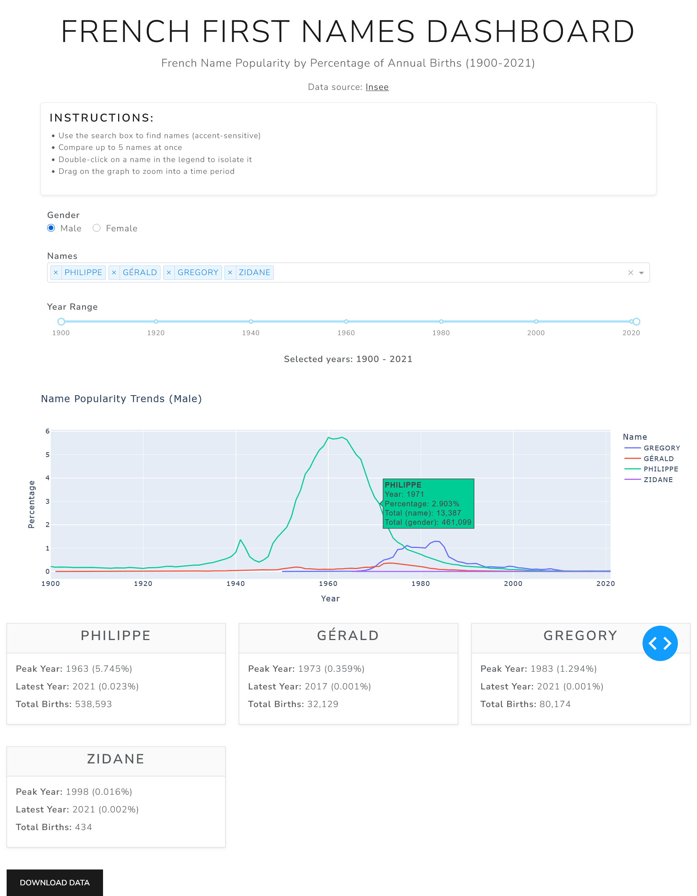

# French First Names Dashboard (% Per Year)
[](https://opensource.org/licenses/MIT)

An interactive dashboard to visualize French first names popularity as a percentage of annual births by gender (1900–2021).



## What Makes This Dashboard Unique

While the National Institute of Statistics (INSEE) already provides [an online tool to visualize the same data](https://www.insee.fr/fr/statistiques/3532172) based on raw counts, this dashboard was created to visualize name popularity **as a percentage of annual births** by gender while providing new and extended features.

### Key Differentiators

- **Percentage-Centric Analysis:** Focusing on proportional representation rather than absolute numbers allows users to compare popularity across different population sizes, understand relative trends independent of birth rate fluctuations, and analyze gender-specific naming patterns.

- **Statistical Depth:** 3-decimal percentage precision provides accuracy for rare names, enhanced hover data brings additional contextual information, and automatic analysis identifies peak popularity years.

- **Enhanced User Experience:** Intuitive controls, real-time feedback with live year range display and dynamic filtering, fully compatible with mobile devices.

- **Technical Innovation:** Performance optimization with cached data processing for faster response times, and a clean, maintainable codebase suitable for open-source sharing.

---

## Features

- **Interactive Visualization:** Line charts showing name popularity trends over time  
- **Advanced Filtering:** Filter by gender, multiple names, and custom year ranges  
- **Statistical Insights:** Peak years, latest data points, and total birth counts per name  
- **Responsive Design:** Works seamlessly on desktop, tablet, and mobile devices  
- **Data Export:** Export filtered datasets as CSV files  
- **High Precision:** 3-decimal percentage accuracy captures trends in rare names  

---

## Tech Stack

- **Dashboard Framework:** Dash & Plotly  
- **Styling:** Bootstrap via `dash-bootstrap-components`  
- **Data Processing:** Python & Pandas (with LRU caching)  
- **Deployment:** Ready for Heroku, Render, or similar platforms  

---

## Quick Start

1. **Clone the repository:**
   ```
   git clone https://github.com/datanama-m/french-first-names-dashboard.git
   cd french-first-names-dashboard
   ```

2. **Set up virtual environment:**
   ```
   # Create virtual environment
   python -m venv .venv

   # Activate virtual environment
   # On macOS/Linux:
   source .venv/bin/activate

   # On Windows CMD:
   .venv\Scripts\activate
   ```

3. **Install dependencies:**
   ```
   pip install -r requirements.txt
   ```

4. **Run the dashboard:**
   ```
   python app.py
   ```

5. **Open your browser:**
   Navigate to [http://127.0.0.1:8050](http://127.0.0.1:8050)

---

## Usage Guide

1. **Select Gender:** Choose between Male or Female names using the radio buttons  
2. **Choose Names:** Use the dropdown to select up to 5 names for comparison  
3. **Set Year Range:** Adjust the slider to focus on specific time periods  
4. **Analyze Trends:** View the interactive chart and detailed statistics cards  
5. **Export Data:** Click "Download Data" to export your filtered results as CSV  

---

## Data Source

Dataset sourced from [INSEE (French National Institute of Statistics)](https://www.insee.fr/fr/statistiques/2540004#consulter).

**Dataset Details:**  
- **Time Period:** 1900–2021  
- **Coverage:** National French birth records  
- **Granularity:** Annual data by gender and first name  

---

## Contributing

Contributions are welcome! Please feel free to:  
- Open issues for bug reports or feature requests  
- Submit pull requests for improvements  
- Share feedback and suggestions  

---

## About the Author

Built by a data analyst with an admittedly unhealthy obsession with turning messy datasets into beautiful, interactive stories. 

This dashboard was created to demonstrate that data analytics transforms complex datasets into meaningful insights, and that the journey can be both rigorous and enjoyable.

**Technical skills demonstrated:**

- End-to-end data processing and interactive visualization
- Focus on responsive, accessible design  
- Modular and maintainable Python code, made publicly available

When not analyzing French naming trends, I help organizations make data-driven decisions through analytics and digital marketing.

Connect with me by email at [maxime@datanama.net](mailto:maxime@datanama.net)

---

## License

Licensed under the MIT License – see [LICENSE](LICENSE) for details.

---

## Acknowledgments

- INSEE for providing the comprehensive French names dataset  
- Dash/Plotly community for excellent documentation and examples  
- Bootstrap team for responsive UI components
